<style type="text/css">
body, td {
  font-size: 16px;
}
code.r{
  font-size: 14px;
}
</style>

```{r setup, include = FALSE}
future::plan("multicore")
knitr::opts_chunk$set(
  fig.width = 7,
  fig.height = 5,
  fig.retina = 2,
  fig.align = "center",
  out.width = "100%",
  dpi = 300,
  message = FALSE,
  warning = FALSE,
  cache = TRUE,
  autodep = TRUE,
  hiline = TRUE
)

knitr::opts_hooks$set(fig.callout = function(options) {
  if (options$fig.callout) {
    options$echo <- FALSE
    options$out.height <- "99%"
    options$fig.width <- 16
    options$fig.height <- 8
  }
  options
})

options(
  htmltools.dir.version = FALSE,
  width = 90,
  max.print = 9999,
  knitr.table.format = "html",
  crayon.enabled = TRUE
)
```


---
layout: true

# Language and Ontology Processing | 語言即計算
---

語言學有理論嗎 🙈


- THE LEXICON is THE MATRIX ㊙️：需要想像一個終極的研究對象
  - .font70[構詞、詞意區分、概念知識本體、變異與變遷、情意處理與社會網路]
  
--

- 語言研究的時代精神 Zeitgeist ：

  - 社群媒體促生不同語言版本的民主化 <br>
  .font60[<font color="darkblue">歷史文本到言談多模溝通 </font>]
  - 語言、資訊與實在：規約設計 (rule/constraint-based) 到使用觀察 (usage-based) <br>
  .font60[<font color="darkblue"> 原子到量子</font>]
  - 人際到人機互動 <br>
  .font60[<font color="darkblue"> 符碼規則到向量空間</font>]

  
---

layout: true

# Plan

---

- Introduction to `construction.grammar`

- Corpus-based (association) measures

- Computational construction grammar

- Conclusion and on-going works


---

layout: false

class: inverse, center, middle

# *Introduction*


---

# Language in use | 生活中的 (新) 語言使用

(Goldberg, 2019)

.pull-left[
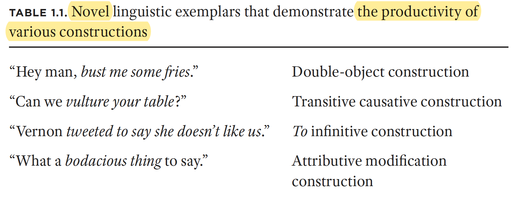
] 

--
.pull-right[
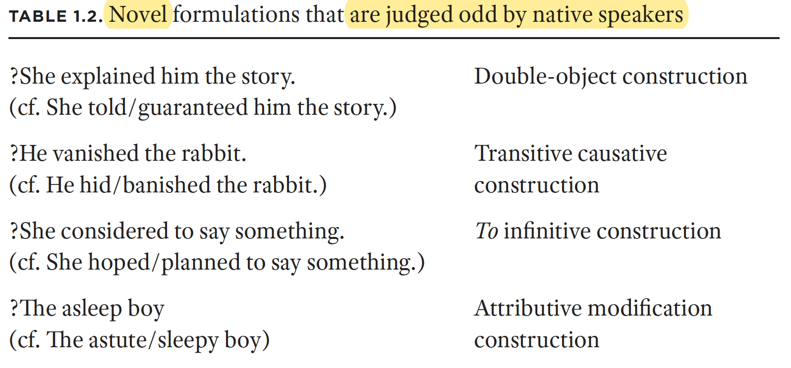
]

--
- The **explain me this** puzzle: USAGE-BASED CONSTRUCTIONIST APPROACH to language.
<!-- partial productivity of constructions-->


---

# 先從一個「圖文不符」的例子講起
#### 怎麼說一個人帥？

`X 成這樣是要怎麼辦啦`、`要不要這麼 X 啦`、`有 XX 的感覺`、`X 的不要不要的`

.pull-right[
]

--

<!-- Mike：`也是很好意思`-->


---
# 語言表達單位的「連續」


自由語到熟語

- 單字詞 ("`愛`")、雙字詞 ("`愛情`")、三字詞 ("`大不了`")、四字格 ("`沒大沒小`")、四字成語 ("`一葉知秋`")、格言 ("`滿招損謙受益`")、歇後語、諺語 。。


---
# Formulaic Language (語式) | Review

- *Formulae* : <font color = "blue"> 以常用語反覆為特徵，心理上具有預製 (prefabbed) 的語言現象。</font>

- 60 多種相關術語：`定式語` (formulaic sequence/utterance/speech)、`語塊` (chunk)、`詞串` (lexical bundles)、`多詞單位` (multiword expressions)、`搭配詞` (collocation)、`成語` (idioms)、`固定語` (fixed expressions) ...... 

> a sequence, continuous or discontinuous, of words or other meaningelements, which is, or appears to be, prefabricated: that is, stored and retrieved whole from memory at the time of use, rather than being subject to generation or analysis by the language grammar (wray, 2000)


---
# 語式的特徵 | Basic characterization of formulaic language

- 語音連貫性
- 語意組合性（`透明到晦澀`）
- 整體提取性
- 句法常常不合常規
- 使用頻率穩定


---

layout: false

# Construction grammar (C*G) | 構式文法 

--
<br>

- 語式的觀察沒有要探究認知意義，構式文法的理論企圖較大。

> Construction grammar (often abbreviated CxG) is a sociobiological family of theories within the field of cognitive and evolutionary linguistics. These posit that human language consists of constructions, or learned pairings of linguistic forms with meanings. (wiki)


--

> .font90[ $C$ is a CONSTRUCTION iff def $C$ is a form–meaning pair $<F_{i}, S_{i}>$ such
that some aspect of $F_{i}$ or some aspect of $S_{i}$ is not strictly predictable from
$C$'s component parts or from other previously established constructions (Goldberg, <font color ="blue">1995</font>).]


--
> .font90[ Any linguistic pattern is recognized as a construction as long as some aspect
of its form or function is not strictly predictable from its component parts or
from other constructions recognized to exist. In addition, patterns are stored
as constructions even if they are fully predictable as long as they occur with
sufficient frequency (Goldberg, <font color ="blue">2006</font>).]


---

layout: true

# Raison d'être

---

--

.right-column[

.font100[
The common idea is that a speaker's knowledge of his/her language consists of a very large inventory of constructions, where a construction is understood to be of any size and abstractness, from <font color="blue"> a single word to some grammatical aspect of a sentence </font>, such as its Subject-Predicate structure.]


]

--

.left-column[
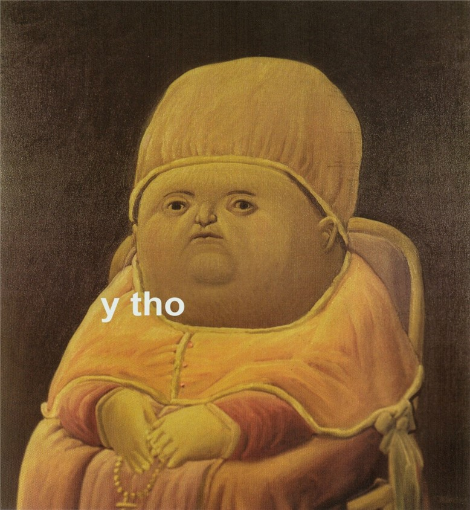
]

--

.right-column[.font130[
`CONTRUCTICON`
]
]

---

layout: true

# Variations and Basic Tenets 
---

不同版本之共享前提
- different versions (Goldberg; Langacker; Croft....) ; a family of theories.
- Most constructional approaches agree on three basic tenets: 
--

<!-- .img-center[ -->
<!--  
] -->

<!-- .footnote[[(Grolemund & Wickham, *R for Data Science*, 2017)](https://r4ds.had.co.nz/)] -->

  `r emo::ji("check")`  constructions are symbolic units  <br>
  `r emo::ji("check")` there is a continuum between lexicon and grammar  <br>
  `r emo::ji("check")` constructions are organized in networks.


---

layout: true

# Constructional Meaning | 意義是建構的

---

--

哲學與認知前提

- bottom-up, usage-based .font70[浮現語法觀], self-adaptive /complex system

> emphasizes that exemplars— structured representations— cluster
within a hyper- dimensional conceptual space giving rise to emergent constructions,
which are then extendable as needed for the purpose of communication.

- monotonic, non-derivational (thus no transformation rule, etc). <br>
.font70[單層級，不推導。句法現象不是由生成規則運算而生的副產品（如被動不是由主動推導出來）]

--

.img-right-small[
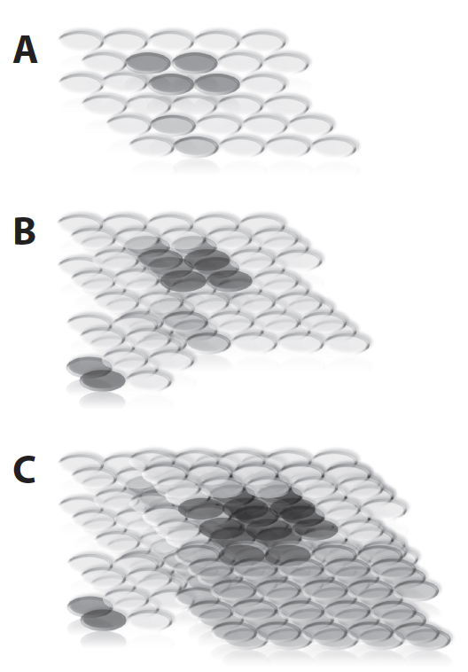
]

<!--also intended to convey that as memory traces accrue, their status
as unique encounters gives way to an emergent cluster (or “cloud”), which
constitutes what we think of as a single coherent word meaning (or lemma).-->


---

layout: true

# (I) Form-Meaning Pairings 
---

「形意對」的符碼單位

- The formal aspect of a construction is typically described as a syntactic template, but the form covers more than just syntax, as it also involves phonological aspects, such as prosody and intonation. The content covers semantic as well as pragmatic meaning.

--

- .font80[大部分的構式具有（不同程度的）「不可預測性」的特質。（如：【X 什麼 X】具有否定、斥責）。成分與構式之間的規約與語意激發關係值得探究。]

---
layout: true

# (II) Syntax-lexicon continuum    
---


<!-- 如果句法本身有意義，就是詞項。所以句法與詞彙界線模糊。 -->

「非模組性」打破語言學知識分界

- collapse the classical distinctions between semantics, syntax and pragmatics (or, treated holistically.) <br>
.font70[每個語法 chunk 都是形式、意義/用法的整體 (Gestalt)]
- construction grammarians argue that all pairings of form and meaning are constructions including phrase structures, idioms, words and even morphemes.  
.font70[涵蓋從語素到句子各級句法單位，甚至詞類的構式]


--

> They laughed him out of the room. (town/court) 

.font70[It means that they laughed at you until you were so embarrassed that you left the room and kept laughing as you left. > the normally intransitive verb receives a transitive reading and the situation can be interpreted on the basis of the 'X cause Y to move' construction rather than the syntactic deviance alone.]


---
layout: true

# (III) Cognitive Organization

---

- Grammar as a taxonomic inventory of constructions, which are based on the same principles as those of the conceptual categories known from cognitive linguistics, such as
    - inheritance
    - prototypicality
    - extensions
    - multiple parenting


---
layout: true

# 訊息的儲存、組織與表徵
---

different models are proposed in relation to how information is stored in the taxonomies.

- full-entry/usage-based/default inheritance/complete inheritance model ......
- since the late nineties there has been a shift towards a general preference for the usage-based model. The shift towards the usage-based approach in CxG has inspired several the development of corpus-based methodologies of constructional analysis.


> The usage-based model is based on inductive learning, meaning that linguistic knowledge is acquired in a bottom-up manner through use. It allows for redundancy and generalizations, because the language user generalizes over recurring experiences of use.


---
layout: true

# Reflections
---

Is C*G a (scientific) theory or a perspective?

- cognitive commitment
  - the structures of language emerge from interrelated patterns of experience, social interaction, and cognitive processes.
  
<!-- 飛紐約 （不及物帶賓語？以飛行方式去紐約。去紐約這個位移事件被隱含在構式中）-->
 


--
- computational commitment


---
layout: false

class: inverse, center, middle

# *Chinese Examples*


---
layout: true

# Affixoid | 類詞綴
---

#### Computational modeling of Affixoid Behaviour in Chinese Morphology 


.left-column[.font70[

- The morphological status of most Chinese morphemes is indeterminate; rarely derivational and hardly ever inflectional (Hsieh and Huang, forthcoming) <br>
- Modeling affixoid beheviour (Tseng, Hsieh, Chen and Court, 2020)
]

]

--
.right-column[

.img-small[
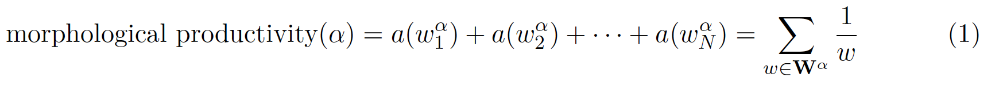
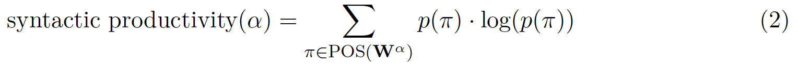
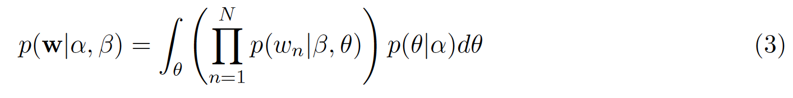
]


.img-right[
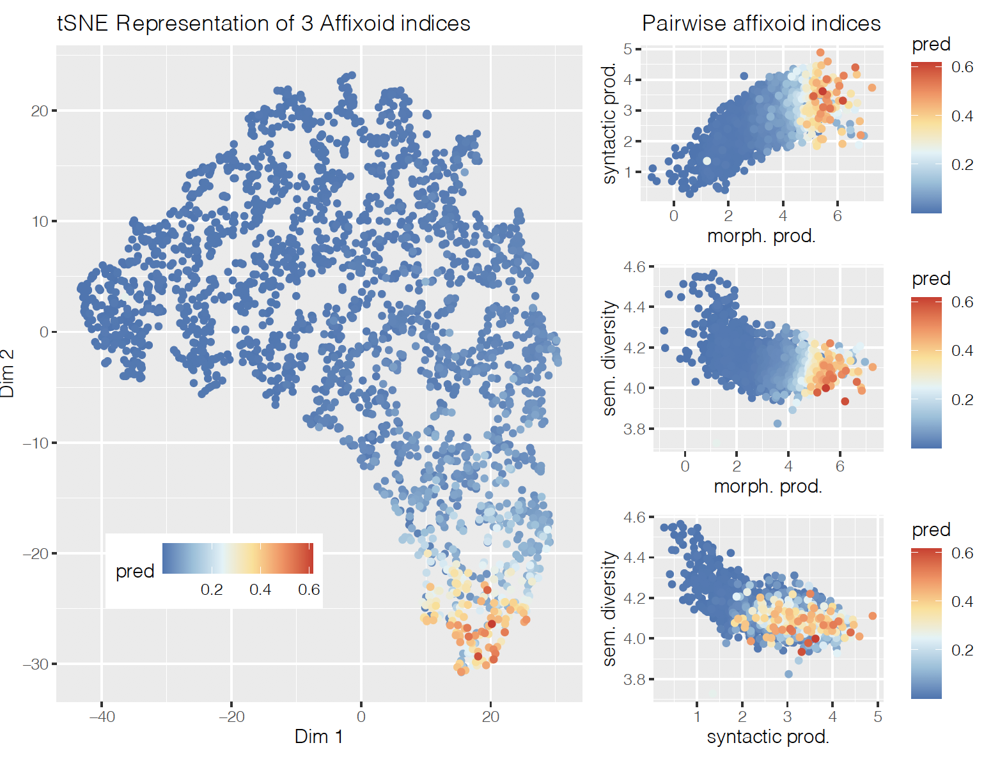

]
]


---
layout: true

# QIEs and Idioms | 四字格與成語

---

[華語四字格詞彙網路的認知神經研究 2017-8](http://lope.linguistics.ntu.edu.tw/bmq/)

- Prefabs 體現了構式的特點
  - .font70[例：`X頭X尾`：虎頭蛇尾、沒頭沒尾、有頭沒尾、徹頭徹尾、從頭到尾、街頭巷尾]

- 結構對詞彙給出了限制


.pull-right[
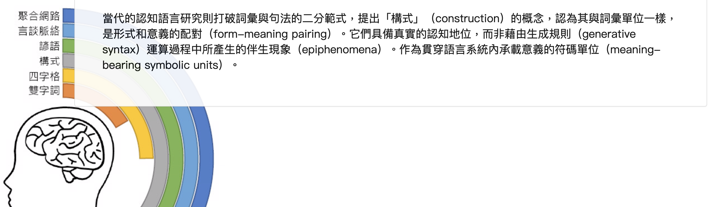
]


.footnote[[(Hsieh et al, 2017), *Entrenchment and Creativity in Chinese Quadrasyllabic Idiomatic Expressions*](https://docs.google.com/presentation/d/1bZ9rrVDtkJ_nLi7zwFpGR2xiWgFJOMQ8/edit#slide=id.p1)]


---
layout: true

# QIEs and Neural Evidence
---


.img-right[
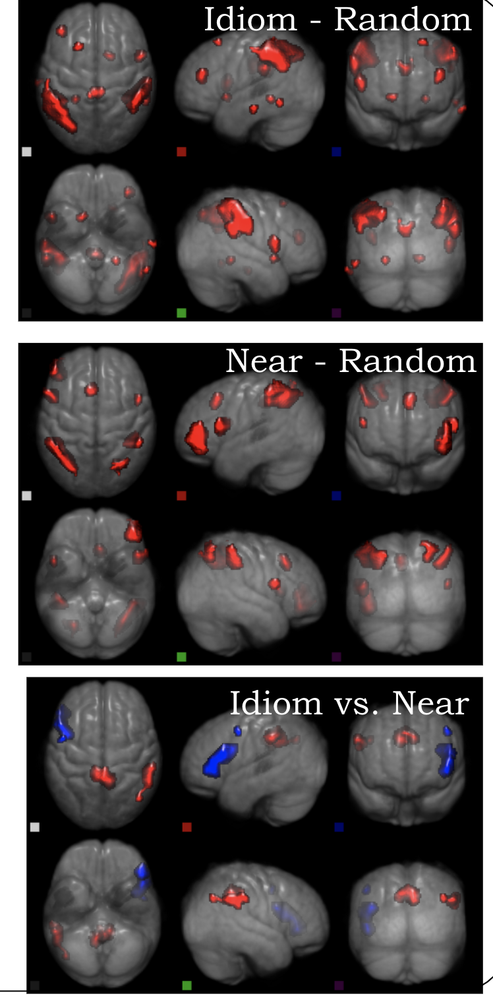

]

--

- .font70[We hypothesized that when primed with idioms (and other prefabs QIEs) whose construction are ‘entrenched’, language
speakers should be faster in comprehension task, and when the QIEs are not recognizable as fixed units, semantically related
targets within the constraints set by construction do play a determining role in the acceptance of QIEs variants.]


<!-- Neurolinguistic work on individual constructions is still in its infancy.  
But in one experiment, participants passively read blocks of instances of the double object
construction and the caused- motion construction, as in (3.14) and (3.15) respectively.-->

<!--
- Examples of the double- object construction <br>
  - James e- mailed Matt a document.

- Examples of the caused- motion construction
  - James e- mailed a document to Matt.
-->

<!-- As in these examples, the same nouns and verbs were used across the two types -->
<!-- of blocks and the corresponding sentences had very similar meanings. A newer -->
<!-- type of analysis of fMRI data, multivoxel pattern analysis (MVPA), allows researchers -->
<!-- to determine whether patterns of activation in particular areas are -->
<!-- capable of distinguishing similar stimuli. Allen et al. (2012) were in fact able to -->
<!-- distinguish the double- object and caused- motion constructions, even though -->
<!-- propositional content, nouns and verbs, complexity, and frequency were controlled -->
<!-- for. Critically involved in the discrimination was an anterior temporal -->
<!-- region in the left hemisphere (left anterior Brodmann’s area 22) that is known -->
<!-- to be evoked by semantic composition, suggesting that the two constructions -->
<!-- differ subtly in how their meanings are composed. A related study comparing -->
<!-- actives and passives similarly found discrimination was possible in nearby temporal -->
<!-- areas of the cortex also known to be involved in semantic combination -->
<!-- (Frankland and Greene, 2015). -->


---
layout: true
# Construction and Lexical Semantics 
---


- .font70[結構本身具有獨立於其組成成分（詞彙）之外的意義] 

> 意義包括語意訊息，也同時包括焦點、話題、語體風格、方言差異等語用內容。

- .font70[構式語法的目的是全面描述語言事實(full range of facts)，對比於當前重視「核心語法」的生成語法觀。希望朝向開放的語言哲學觀，同時具備一套嚴謹的基於合一運算的形式表達法，主張把語法與詞彙、語意、語用、韻律作為一個整體來分析。]


- .font70[詞彙語意 vs 構式語意舉例 <br>

  1. He gave her a cake.
  2. He sneezed the napkin off the table.
  3. She baked him a cake.

--

  1.【有 + bare N】
  2.【有 + 數量 NP + ADJ】 

]


.footnote[漢語文獻: (黃居仁等 1999) (王惠 2006)]


---
layout: true
# Construction and Lexical Semantics 
---

<font color=#0000FF>（論元的）動態義（臨時義）</font> (.font60[注疏中的「隨文釋義」、「緣事生訓」、「因文詁義」])

- 一個詞本來沒有某項意義，用到某一個特定的結構中卻可表達一項意義。

- 詞彙語意與結構語意的區分（只有擺脫結構語意的意義，才是詞意，才得以設立義項）


---
layout: true
# Construction in opinionated texts
---

語意與情緒

> Experiences of emotions may be included as conceptual archetypes that provide the cognitive foundation for linking basic grammatical constructs with semantic categorization (Langacker, 1999)

- Emotions are *forces* and emotional experiences are *causal-evaluative events*. This also explains that conventionalized expressions of emotion are highly metaphorical and metonymic in nature, pertaining to embodied experiences of physiological reactions. 


- <font color=#0000FF>Emotional predicates</font> (aka. *mental verbs, verbs of psychological state*,  or *psych-verbs*, *psychological predicates*, *verbs of affect*) refer to the class of lemmas that encode a state or an event involving an internal, affective experience.


.footnote[Liu, 2016]


---
layout: true
# Aspect-based Sentiment Analysis as case study


> Opinionated text can be defined as the text acquired from blogs, social networking sites or any other online portal in which the users have expressed their disposition and point of view towards any particular product or service. 

- .font70[[語言是情意表達的戰場：實例](https://lopentu.github.io/casa/threads-sample-every50.html)]

- Reversal of Emotions in (**short texts**)
  - opposites
  - negation
  - irony


.footnote[[中華電信輿情分析 2017-8; 2020-21](http://140.112.147.132:9090/)]


---
layout: true
# Internet Meme and Multimodal C*G
---


- **Internet Memes** provide a growing volume of multimodal data. (cf. `Multimodal Meme Dataset`(Suryawanshi et al. 2020))

- Typical image macro includes 3 element:
  - a background **image**
  - top **text** that often *formulaic* and easily recognizable
  - bottom text that often delivers the *punch line* of the theme.


.img-right[


]


---
layout: true
# Internet Meme and Multimodal C*G
---

- Our preliminary computational modeling results (Lin and Hsieh, 2020) shows that 
  - IMs are multimodal constructions in nature.
  - Different modalities (`verbal-visual incongruity`) demonstrates differences in *saliency* (or *Figure/Ground* contrast). 

 
.img-right[
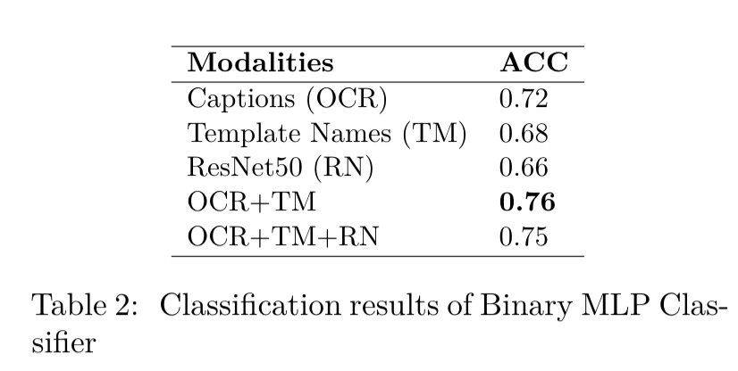]

--

- Multimodal Construction Grammar <br> 
(Zima and Bergs 2017; Zenner and Geeraerts 2018)

<!--https://www.overleaf.com/project/5fb76bef1d4efca7e0769a07-->


---
layout:true
# Internet Video Meme and Multimodal C*G 
---

Construction Grammar explained in 11 memes
.font70[連 CG 都可以用迷因解釋的時代]

```{r, echo=FALSE}
library("vembedr")
embed_url("https://youtu.be/ZolU6xIKeLA") %>%
  use_start_time("8m24") %>%
  use_align("center")
```


---
layout:true
# 當代社會文化與構式理論 
---

> Construction grammar (often abbreviated CxG) is a sociobiological family of theories within the field of cognitive and evolutionary linguistics. These posit that human language consists of constructions, or learned pairings of linguistic forms with meanings. Constructions correspond to replicators or memes in memetics and other cultural replicator theories. It is argued that construction grammar is not an original model of cultural evolution, but for essential part the same as memetics. 


- Internet Meme and Participatory Culture (`#TikTokization`)


```{r, echo=FALSE}
library("vembedr")
embed_url("https://youtu.be/QHROwZHvLR4") %>%
  use_align("center")
```


---
layout: false

class: inverse, center, middle

# *Corpus-based (association) measures*

---
layout: true
# 搭配 collogation、搭構 collostruction 與構式 construction
---

兩個德國 Stefan (Evert and Gries) 

- Collocations as a linguistic epiphenomenon: [collocation statistics 綜整](collocations.de)

- [collostructional analysis 介紹](http://www.stgries.info/teaching/groningen/index.html): a blend of  
  - Collocation: preferential lexical company kept by a word
  - Construction (in a Construction Grammar sense): form-meaning pairing that constitutes a basic unit in language


<!-- ROCLING 程式實作與例子 ptt -->


---
# Collocates vs Collexemes


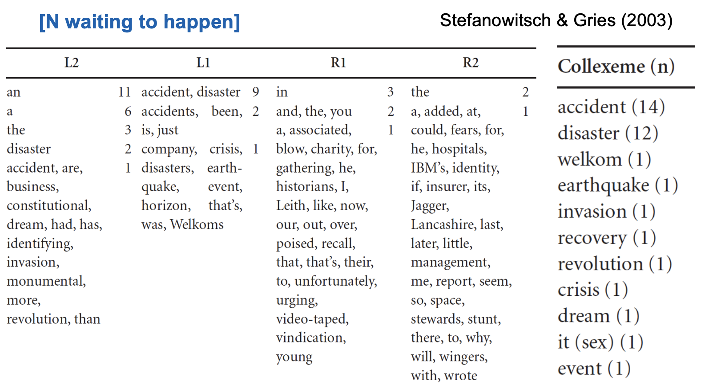{width=20%}


---
# Issues

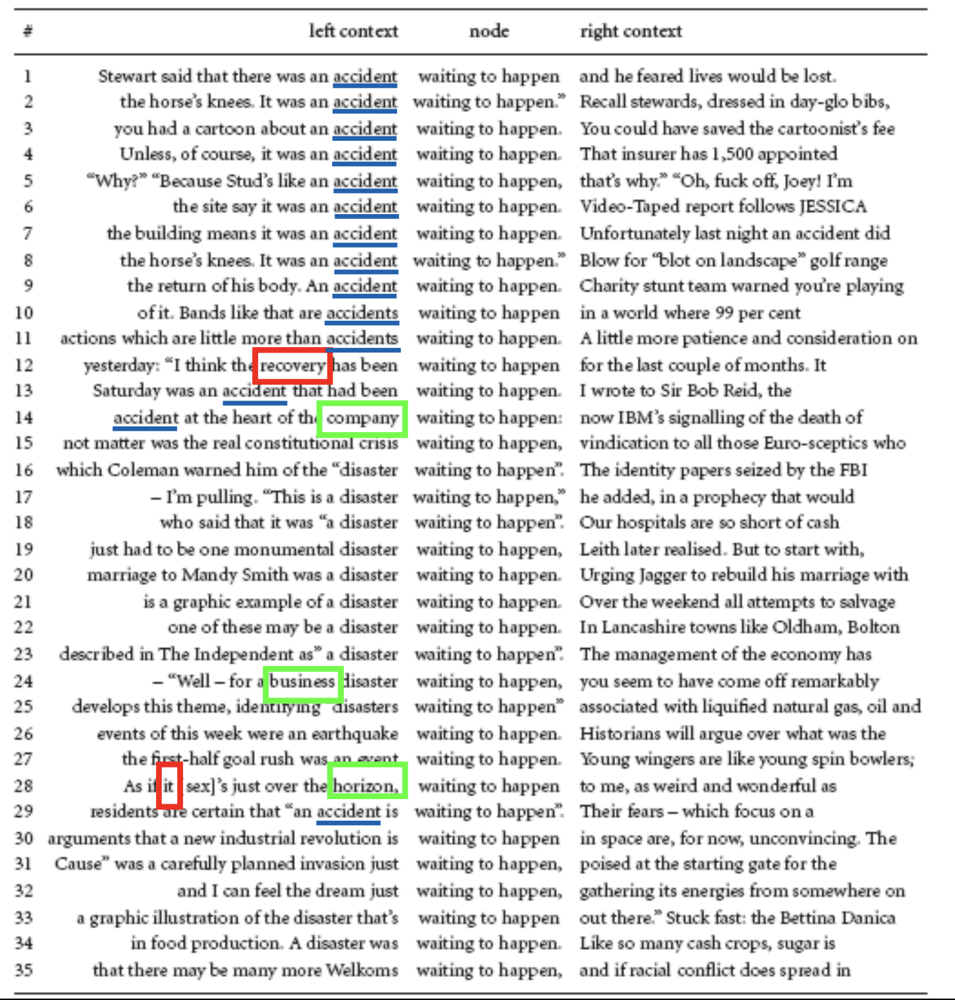{width=20%}


---
layout: true
# Collostructional analysis (Gries, 2020)

---

--
.left-column[
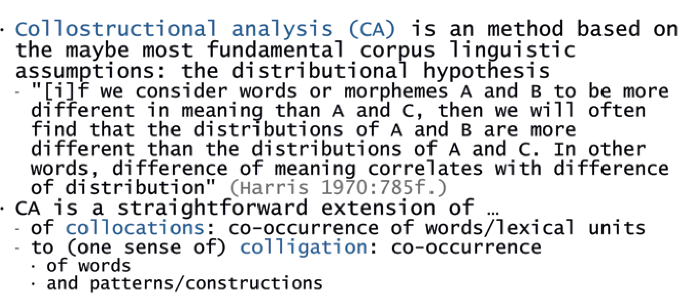

]

--
.right-column[

在構式語法 (construction grammar) 架構下，Stefanowitsch and Gries (2003) 發展一套分析法稱 **搭構分析** (collostructional analysis)

-  <font color=#0000FF>Collexeme analysis</font> measures the mutual attraction of lexemes and constructions. 

-  <font color=#0000FF>Distinctive collexeme analysis </font> contrasts alternating constructions in their respective collocational preferences (Gries and Stefanowitsch 2004b). 

- To measure the association between the two slots of the same construction, a third method known as  <font color=#0000FF>covarying-collexeme analysis</font> is used (Gries and Stefanowitsch 2004a; Stefanowitsch and Gries 2005).

]


---
layout: true
# Collostruction analysis in practice
---

- Involved corpus-based statistical calculation to measure the **association strength** (`attraction/repulsion`) between the construction and its 'collexemes'.


.img-center[
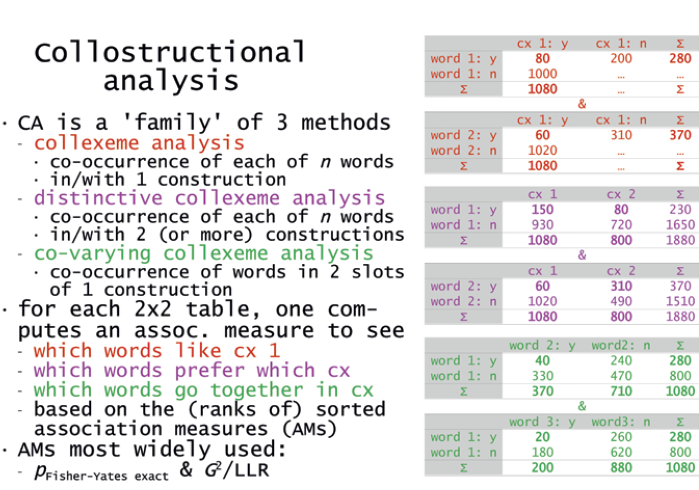
]


---
layout: true
# 語料庫程式實作工作坊 2020

---
[公開連結](https://github.com/lopentu/Hands-on_Corpus_Linguistics/tree/main/hocor2020)


.img-center[
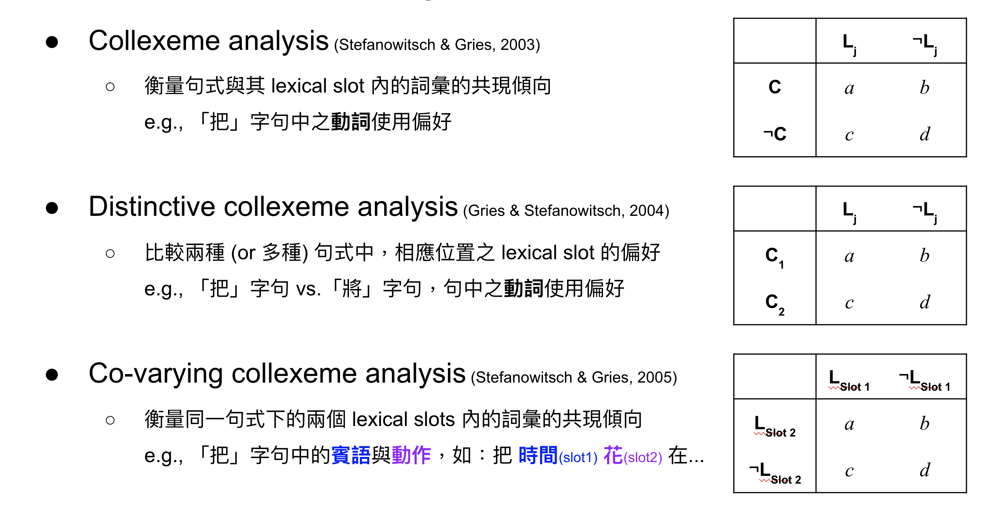
] .font50[(slide credit: 廖永賦)]


---
layout: true
# PTT 構式分析舉例
---

- 「實在是」、「不能不說是」、「最好是」、......
「可以再 XX (一點)」「還在那邊 XX」 、「XX 不意外」、「是在 XX」

- 假設我們想研究`「可以再 XX (一點)」`的(負面)語意韻/情感含義，大家會怎麼做？

- [R 實作參考](http://www.stgries.info/teaching/groningen/coll.analysis.r); [Python 實作參考](https://github.com/lopentu/Hands-on_Corpus_Linguistics/tree/main/hocor2020) 


---
layout: true

# Interim summary
---

<br>
- 構式語法與當代認知科學發現的關聯應該是正相關

- 語料庫語言學做出了共現現象的計量觀察與顯著檢定嘗試（至少在經驗基礎上提供了 Exploratory Data Analysis 的計算環境）

但，如果構式不僅是作為一種 add-on 的語言(處理)資源，而是提供理論的基礎時，計算構式 (CoCoGram) 應該如何發生？


---
layout: true

# 計算構式 (CoCoGram) 先導問題
---


- `如何「辨識」構式？` `如何解決同一性`？

- `如何表徵符碼與意義?` "The form and content are symbolically linked" (form-meaning pairs) but how can both to be co-represented?

- `有無自然邊界？如何調節更新流動與變異？` are texts possible to be naturally chunked? reconcile varieties? roles in the understanding of the text/language? 

- `隱性知識本體如何紬繹與回饋？` how a 'provisional unit boundary' can be detected, the 'linear unit of meaning' (linear unit grammar) be acquired and latent hierarchy can be discerned in the linear string of word forms? 


<!-- - 等語線的隱喻？ -->


---
layout: true

# 計算構式 [1] 如何辨識
---


---
layout: true

# Computational (Lexical) Semantics
---


- 語言理論無法忽略語意

- 語言理論要能解釋 (Pustejovsky, 1996)：
  - polymorphism
  - semanticality
  - creative use 
  - co-composition
  
- How generalizations (or "rules") are learned and constrained, and allowed for the creative use.

--

.pull-right[
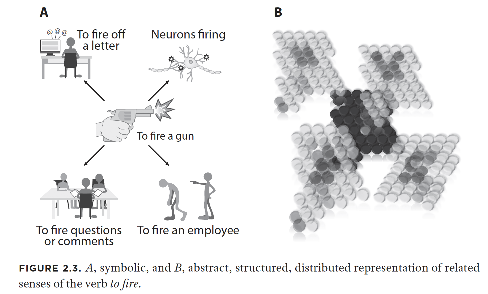
.font60[(Goldberg, 2019)]
]


---
layout: false

class: inverse, center, middle

# *Computational construction grammar (and NLU)*
---

COCOGram aims to operationalize insights and analyses from construction grammar as computational processing models.

It does not only allow for automatic validation of the preciseness and consistency of construction grammar models, and to run these models on text corpora, but also to make use of construction grammar insights to enhance the performance of language technology applications.

- 機器學習與驗證是關鍵

---
layout: true

# 目前學界想法
---

- **Fluid Construction Grammar (FCG)** <br>
(Remi van Trijp, 2020; [https://www.youtube.com/watch?v=YTKHllV4MCU](https://www.youtube.com/watch?v=YTKHllV4MCU))
  - traditional linguistic processing : vertically eat layer-by-layer >> pipelined NLP
  - constructionist > horizontally eat all

- **Construction Grammar Induction**
  - Computational learning of construction grammar (Dunn, 2017)


---
layout: true
# Proposal
---

> Like words, (grammatical) constructions invite learners/speakers to form categories

語言資源的優先意義：人 EDA and 機 gold standard

- 同時做 `CWN` (wordnet) 與 `CCN` (construtionNet)
  - `word` 是較穩定的 `construction`
  - CWN 底層預設核心是 **synset**, CCN 是 **argument structure construction (ASC, Goldberg 1992)**.

- 一個 synset 是由至少一個 form (lemma)-meaning (sense) pair 組成

- `Lexicon` vs `ConstructIcon`: the latter "including words, partially filled words (aka morphemes), and representations that are larger than single words, all represented in a complex dynamic network, much as we have long known to be true of the lexicon."  


- 應用先選擇情緒分析


---
layout: true
# Steps
---

- [top-down] compile an (incomplete) list of ASCs in Mandarin (modelled on English, cf. Goldberg 2019:p35);
similar to `constructionalized ontology` (as opposed to `lexicalied ontology`).

- [bottom-up] manual selection with corpus check (Entropy or other measures?)


? Need to implement `Semantic Role Labeling`


---
layout: false

class: inverse, center, middle

# *Conclusion and Future/on-going works*

---
layout: true
# Conclusion
---


- .font70[語料庫量度成就了EDA，在漢語與台灣南島語言上可以多做比較]<br>
- .font70[認知計算構式方才開始，符碼序列無邊界線索的語言文字提供最難與最關鍵的養分 
  - (Symbolic) form and (Sub-symbolic) meaning representation
  - CG induction algorithm] 


---
layout: true

# On-going works
---


- 構式與變異：理論跟著語料（語言使用）走 <br>
> .font70[他哭奶奶/小孩就活個媽媽/飛上海/跑生意/跑百米/走八卦掌/喊一聲嗓子/闖紅燈 (郭繼懋 1999)]

- Sense-aware Construction/Collostructional Analysis <br>
[Chinese Sense Tagger]()


---
layout: true

# Reference
---


- Bergen, Benjamin & Nancy Chang (2005). "Embodied Construction Grammar in Simulation-Based Language Understanding". In J.-O. Östman & M. Fried, ed. Construction Grammar(s): Cognitive and Cross-Language Dimensions. Amsterdam: John Benjamins. .
- Croft, William A (2001). Radical Construction Grammar: Syntactic Theory in Typological Perspective. Oxford: Oxford University Press.
- Croft, William A. & D. Alan Cruse (200). Cognitive Linguistics. Cambridge: Cambridge University Press.
- Fillmore, Charles, Paul Kay and Catherine O'Connor (1988). "Regularity and idiomaticity in grammatical constructions: the case of let alone". Language, 64. 501-38.
- Goldberg, Adele (1995). Constructions: A Construction Grammar Approach to Argument Structure. Chicago: University of Chicago Press.
- Goldberg, Adele (2006). Constructions at Work: the nature of generalization in language. Oxford: Oxford University Press.
- Goldberg, A. (2019). *Explain me this: Creativity, Competition, and the Partial Productivity of Constructions*. Princeton University Press.

---
layout: true

# Reference II
---

- Hsieh, S.K. et al. (2017). *cognitive neurological base of idiomatic network in chinese*. ICCS.
- Lakoff, George (1987). Women, Fire, and Dangerous Things: What Categories Reveal about the Mind. Chicago: CSLI.
- Langacker, Ronald (1987, 1991). Foundations of Cognitive Grammar. Vols I-II. Stanford: Stanford University Press.
- Michaelis, Laura A. & Josef Ruppenhofer (2001). Beyond Alternations: A Construction-based Account of the Applicative Construction in German. Stanford: CSLI.

- 王惠。(2005).從構式語法理論看漢語詞意研究。


